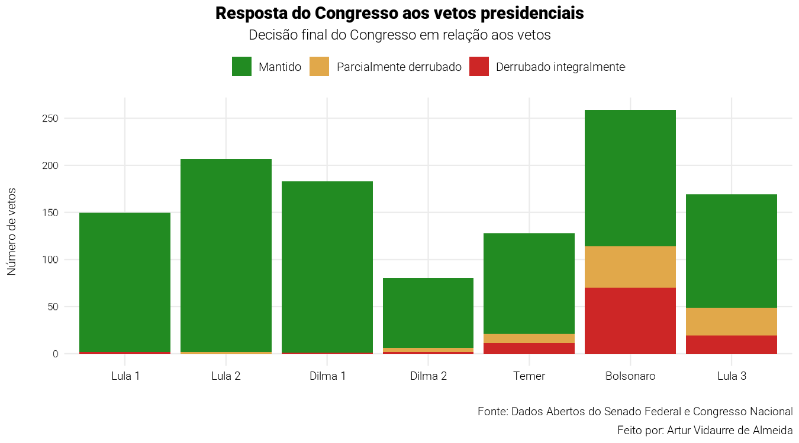

# Vetos Presidenciais no Brasil

Análise dos vetos presidenciais e da decisão final do Congresso Nacional, do
governo FHC 1 ao Lula 3, a partir da API de Dados Abertos do Senado.



## Como rodar

Requer **R ≥ 4.5**.

```r
install.packages(c(
  "httr2", "jsonlite", "purrr", "dplyr", "tidyr", "lubridate",
  "stringr", "forcats", "fs", "glue", "ggplot2", "scales",
  "here", "sysfonts", "showtext"
))

source("scripts/01_coleta_vetos.R")
source("scripts/02_coleta_sancoes.R")
source("scripts/03_tratamento.R")
source("scripts/04_analise_descritiva.R")
source("scripts/05_graficos.R")
```

A coleta usa cache por arquivo — rodar 01/02 de novo só baixa o que falta.

## Scripts

| Script | O que faz |
|---|---|
| `01_coleta_vetos.R` | Baixa, ano a ano, a lista de vetos da API do Senado, o resultado dispositivo a dispositivo de cada um e o detalhe da matéria associada. Saída: JSONs em `data/raw/`. |
| `02_coleta_sancoes.R` | Baixa todas as Leis Ordinárias e Complementares assinadas entre 1995 e hoje. Saída: JSONs em `data/raw/leis_por_ano/`. |
| `03_tratamento.R` | Lê os JSONs, define a tabela de mandatos, atribui cada veto e cada lei ao presidente em exercício na data e classifica cada veto em `mantido`, `derrubado`, `parcialmente_derrubado` ou `em_tramitacao`. Saída: `vetos.rds`, `dispositivos.rds`, `leis.rds`, `mandatos.rds` em `data/processed/`. |
| `04_analise_descritiva.R` | Calcula as agregações por mandato (sanção × veto, decisão do Congresso, taxa de derrota, dispositivos derrubados). Saída: `data/processed/resumos.rds`. |
| `05_graficos.R` | Gera os 6 PNGs em `outputs/`. |

## Saída

| Arquivo em `outputs/` | Pergunta |
|---|---|
| `01_decisao_presidencial.png` | Quanto cada presidente sancionou vs. vetou? |
| `02_decisao_presidencial_pct.png` | Mesma comparação em proporção |
| `03_congresso_decisao.png` | O Congresso manteve, derrubou parcial ou integralmente? |
| `04_congresso_por_tipo.png` | Mesma análise, separando vetos integrais e parciais |
| `05_dispositivos.png` | Dispositivos derrubados por presidente |
| `06_taxa_derrota.png` | Taxa de derrota dos vetos no Congresso |

## Limitações

- API retorna apenas 2 vetos para FHC 1 (1995–1998); os gráficos finais excluem FHC.
- A flag `EmTramitacao` aparece desatualizada para alguns vetos antigos — o script prioriza a evidência dos dispositivos.
