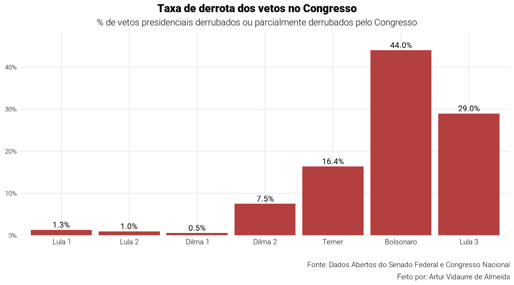

# Vetos Presidenciais no Brasil

Este repositório contém uma análise dos vetos presidenciais e da decisão final do Congresso Nacional, do governo FHC 1 ao Lula 3. A coleta e o tratamento dos dados são feitos em R a partir da API de Dados Abertos do Senado Federal.

## 📊 Funcionalidades

A análise está estruturada em quatro etapas sequenciais:

- **Coleta de vetos**: Baixa, ano a ano, a lista de vetos presidenciais, o resultado dispositivo a dispositivo de cada um e o detalhe da matéria associada.
- **Coleta de sanções**: Baixa todas as Leis Ordinárias e Complementares assinadas entre 1995 e o ano corrente, usadas como base de comparação proporcional.
- **Tratamento e classificação**: Atribui cada veto e cada lei ao presidente em exercício na data e classifica cada veto em `mantido`, `derrubado`, `parcialmente_derrubado` ou `em_tramitacao`.
- **Análise descritiva e gráficos**: Calcula agregações por mandato (sanção × veto, decisão do Congresso, taxa de derrota, dispositivos derrubados) e gera os 6 gráficos finais.

## 📁 Estrutura do Projeto

- `scripts/01_coleta_vetos.R`: Coleta da lista anual de vetos, do resultado por dispositivo e do detalhe da matéria.
- `scripts/02_coleta_sancoes.R`: Coleta das Leis Ordinárias e Complementares assinadas entre 1995 e hoje.
- `scripts/03_tratamento.R`: Definição da tabela de mandatos, atribuição presidencial e classificação dos vetos.
- `scripts/04_analise_descritiva.R`: Agregações por mandato consumidas pelos gráficos.
- `scripts/05_graficos.R`: Geração dos 6 PNGs em `outputs/`.
- `data/raw/`: JSONs brutos baixados da API (cache por arquivo).
- `data/processed/`: Tabelas tratadas em `.rds` (`vetos`, `dispositivos`, `leis`, `mandatos`, `resumos`).
- `outputs/`: Gráficos finais em PNG.

## 🛠️ Tecnologias Utilizadas

- **Linguagem**: R (≥ 4.5)
- **Coleta**: httr2, jsonlite
- **Tratamento**: dplyr, tidyr, purrr, lubridate, stringr, forcats
- **Visualização**: ggplot2, scales, sysfonts, showtext

## 📊 Fonte dos Dados

Os dados foram extraídos da [API de Dados Abertos do Senado Federal](https://legis.senado.leg.br/dadosabertos/), cobrindo vetos e leis assinadas entre 1995 e o ano corrente.

## ⚠️ Limitações

- A API retorna apenas 2 vetos para FHC 1 (1995–1998); os gráficos finais excluem FHC.
- A flag `EmTramitacao` aparece desatualizada para alguns vetos antigos — o script prioriza a evidência dos dispositivos.

## 👤 Autor

Artur Vidaurre de Almeida
